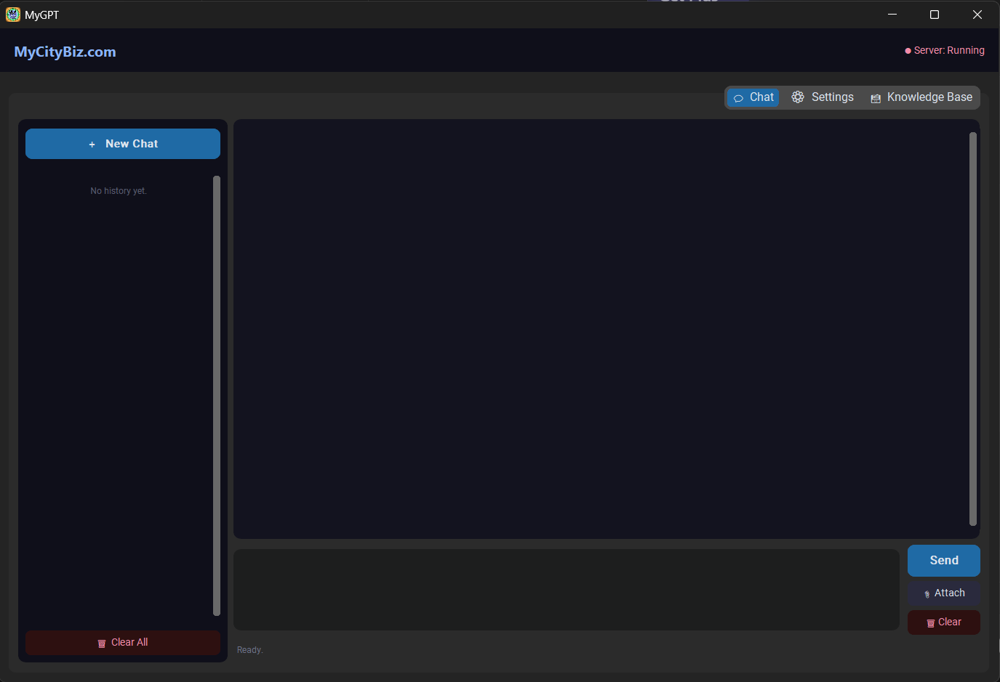
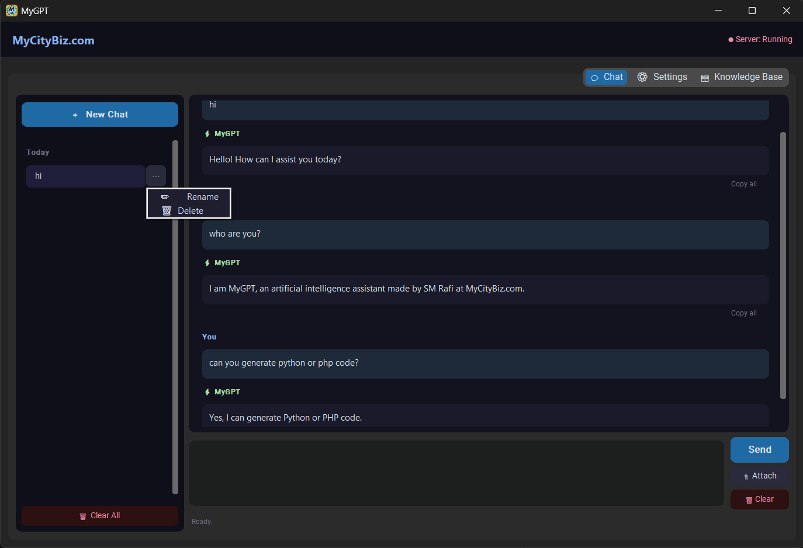
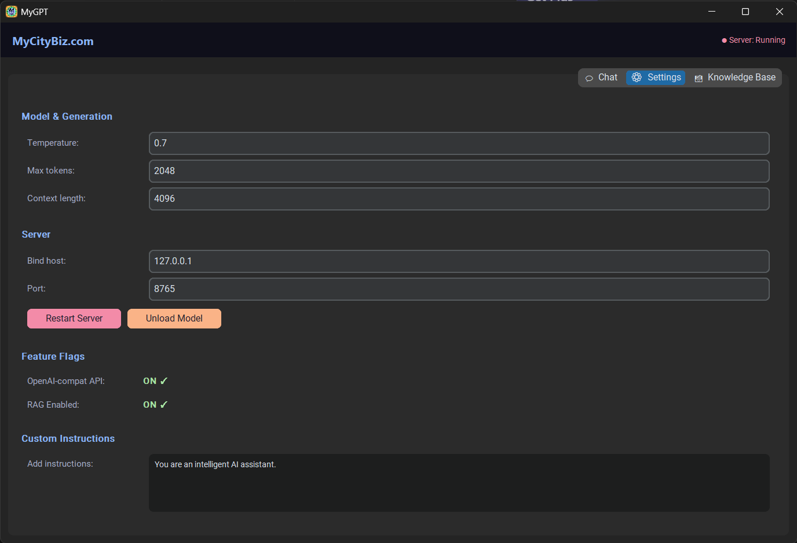
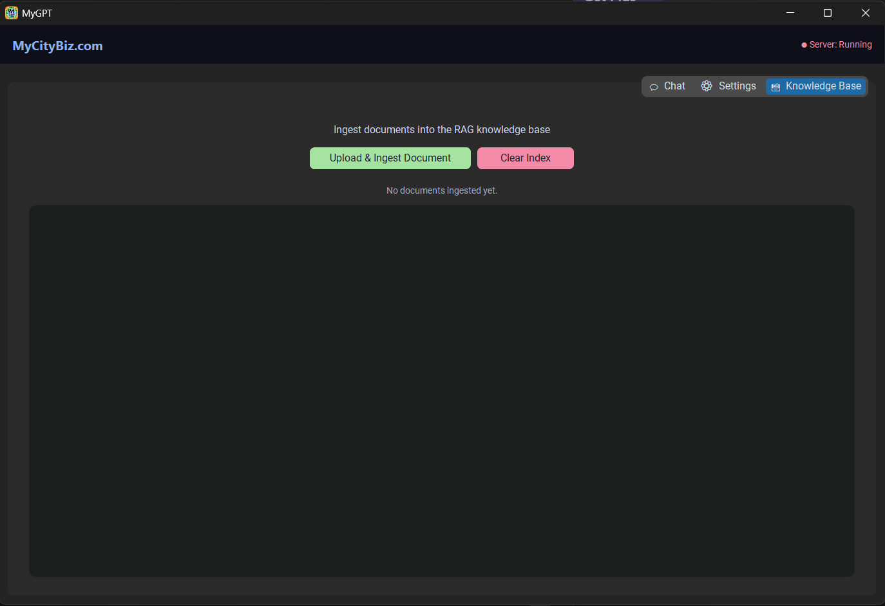

# offline-ai-chat-app
A standalone AI chat application built using Python that works completely offline using a lightweight local LLM. This project demonstrates the ability to build fully offline AI systems for secure, private, and low-connectivity environments.

Copy .env.example → .env and fill values

Model downloads automatically on first launch

Run command: python main.py

Build command: uv run python -m PyInstaller rafigpt.spec --clean

## 📸 Screenshots

## ⬇️ Download Ready-to-Use App

👉 https://gpt.smrafi.com/Rafigpt.zip

### Steps:
1. Download ZIP  
2. Extract  
3. Run .exe  
4. Keep internet ON for first run  
5. Use offline after setup

## 🧩 Architecture

See: docs/architecture.md

## 🎥 Demo video
---coming soon---

## 💼 Need Similar Systems?

We build:
- Offline AI tools  
- Business automation systems  
- Custom software for SMEs
- Webapps & Websites

🌐 https://mycitybiz.com  
📞 Contact for custom solutions
